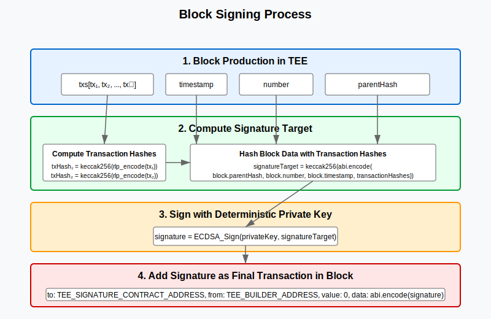
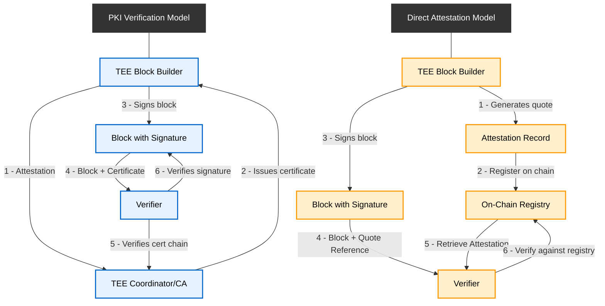
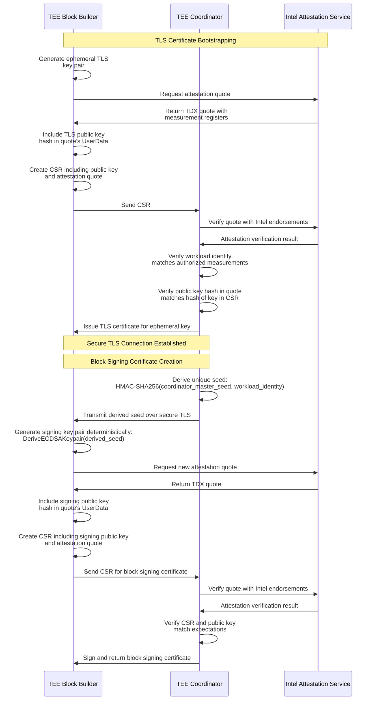

# L2 TEE Block Builder Verification Protocol

## Table of Contents
- [Introduction](#introduction)
- [Design Goals](#design-goals)
- [Protocol Components](#protocol-components)
- [TEE Attestation Mechanism](#tee-attestation-mechanism)
  - [Intel TDX DCAP Attestation](#intel-tdx-dcap-attestation)
  - [Attestation Endorsements](#attestation-endorsements)
- [Workload Identity and Key Management](#workload-identity-and-key-management)
  - [Workload Identity Derivation](#workload-identity-derivation)
  - [Extended Identity with Operator](#extended-identity-with-operator)
  - [Dual Certificate Model and Key Derivation](#dual-certificate-model-and-key-derivation)
- [Block Signatures and Verification](#block-signatures-and-verification)
  - [Block Signing Process](#block-signing-process)
  - [Signature Inclusion within Block](#signature-inclusion-within-block)
  - [Block Verification Material](#block-verification-material)
  - [Block Verification](#block-verification)
- [Certificate Authority Model](#certificate-authority-model)
  - [On-Chain DCAP Attestation for Coordinator](#on-chain-dcap-attestation-for-coordinator)
  - [Dual Certificate Model](#dual-certificate-model)
  - [Certificate Issuance Process](#certificate-issuance-process)
  - [Attested TLS Certificate](#attested-tls-certificate)
  - [Block Signing Certificate](#block-signing-certificate)
- [Rollup Boost Integration](#rollup-boost-integration)
- [Service Connectivity and TLS Authentication](#service-connectivity-and-tls-authentication)
  - [Service Discovery](#service-discovery)
  - [TLS Connection Verification](#tls-connection-verification)
  - [Block Signing Certificate Retrieval](#block-signing-certificate-retrieval)
  - [TEE/Service Identity Verification](#teeservice-identity-verification)
- [Expected Measurements and On-Chain Verification](#expected-measurements-and-on-chain-verification)
  - [Expected Measurement Definition](#expected-measurement-definition)
  - [On-Chain Verification System](#on-chain-verification-system)
- [Reproducible Builds](#reproducible-builds)
- [Measurement Lifecycle](#measurement-lifecycle)
- [Measurement Updates](#measurement-updates)
- [Verification Models](#verification-models)
- [Verification Tool](#verification-tool)
- [Security Considerations](#security-considerations)

## Introduction

This specification describes the attestation and verification protocol for TEE-based L2 block builders. The protocol enables verifiable and transparent guarantees of block production within Trusted Execution Environments (TEEs), allowing any party to verify that blocks were produced according to the expected rules without trusting the operator.

## Design Goals

The L2 TEE Block Builder Verification protocol aims to provide:

1. **Integrity**: Guarantee that blocks are built according to the expected rules
2. **Verifiability**: Allow any party to verify block provenance without trusting the operator
3. **Transparency**: Provide visibility into the code running inside the TEE
4. **No Availability Assumptions**: Prevent any single entity from becoming a verification bottleneck

## Protocol Components

The protocol consists of three key components:

1. **TEE Attestation**: Mechanism to prove that a block builder is running inside a genuine TEE with the expected code
2. **Block Signatures**: Method for signing blocks inside the TEE and verifying these signatures
3. **Expected Measurements**: System for publishing and verifying trusted code configurations

## TEE Attestation Mechanism

Attestation is the process by which a TEE proves its identity and integrity. The protocol uses Intel TDX with DCAP (Data Center Attestation Primitives) attestation.

### Intel TDX DCAP Attestation

TDX attestation produces a Quote structure that contains:

```
TDXQuote {
  Header: QuoteHeader,       // Version and attestation key type info
  TDReport: TDReport,        // TD measurement registers
  TEEExtendedProductID: u16, // TEE product identifier
  TEESecurityVersion: u16,   // Security patch level
  QESecurityVersion: u16,    // Quoting Enclave security version
  QEVendorID: [16]byte,      // Intel Quoting Enclave vendor ID
  UserData: [64]byte,        // User-defined report data (public key hash)
  Signature: byte[],         // ECDSA signature over the Quote
}

TDReport {
  MRTD: [48]byte,           // Measurement register for TD (initial code/data)
  RTMR: [4][48]byte,        // Runtime measurement registers
  MROWNER: [48]byte,        // Measurement register for owner (policy)
  MRCONFIGID: [48]byte,     // Configuration ID
  MROWNER_CONFIG: [48]byte, // Owner-defined configuration
  ReportData: [64]byte      // User-defined data (public key hash)
}
```

The attestation process follows these steps:

1. The TEE generates a TD Report containing its measurement registers and report data
2. The Quote Enclave (QE) creates a Quote by signing the TD Report with an Attestation Key
3. The Quote can be verified against Intel's Provisioning Certification Service (PCS)

### Attestation Endorsements

To validate a TDX Quote, a verifier needs these endorsements:

```
DCAPEndorsements {
  QEIdentity: byte[],       // Quoting Enclave Identity
  TCBInfo: byte[],          // Trusted Computing Base info
  QECertificationData: byte[] // Certification data for the attestation key
}
```

These endorsements provide the trust anchor for the Intel attestation infrastructure.

## Workload Identity and Key Management

### Workload Identity Derivation

A TEE's workload identity is derived from a combination of its measurement registers. The TDX platform provides several registers that capture different aspects of the workload:

```
struct TDXMeasurements {
    bytes MRTD;             // Initial TD measurement (boot loader, initial data)
    bytes[4] RTMR;          // Runtime measurements (extended at runtime)
    bytes MROWNER;          // Contains operator's public key (Ethereum address or other identifier)
    bytes MRCONFIGID;       // Hash of service configuration stored onchain and fetched on boot
    bytes MROWNERCONFIG;    // Contains unique instance ID chosen by the operator
}
```

The workload identity computation takes these registers into account:

```
function DeriveWorkloadIdentity(measurements TDXMeasurements) bytes32 {
    return SHA256(
        measurements.MRTD    ||
        measurements.RTMR[0] ||
        measurements.RTMR[1] || 
        measurements.RTMR[2] || 
        measurements.RTMR[3] ||
        measurements.MROWNER ||
        measurements.MROWNERCONFIG ||
        measurements.MRCONFIGID
    );
}
```

These measurement registers serve specific purposes in the permissioned attestation model:

- **MROWNER**: Contains the operator's public key (Ethereum address or other identifier), establishing who is authorized to run this instance
- **MROWNERCONFIG**: Contains a unique instance ID chosen by the operator, which the operator must sign to authenticate itself
- **MRCONFIGID**: Contains a hash of the actual service configuration that is stored onchain and fetched during boot

All of these values are captured in the workload identity hash, ensuring that any change to the code, configuration, or operator results in a different identity that must be explicitly authorized through governance.

### Extended Identity with Operator

The system uses a permissioned model where operators must be explicitly authorized to run specific workloads. The operator's identity is established through:

1. The **MROWNER** field containing the operator's public key
2. The **MROWNERCONFIG** field containing a unique instance ID chosen by the operator

During TEE initialization, the operator must authenticate itself by providing a signature of the instance ID using the private key corresponding to the public key in MROWNER. This signature is delivered through a secure channel (cloud-init, virtio, attested TLS, etc.). The TEE verifies this signature before proceeding with registration.

This approach ensures that:
- Only authorized operators can run specific workloads
- Each TEE instance has a unique, operator-authenticated identity
- The TEE self-enforces operator authentication before operation

For additional security, an extended identity can be computed:

```
function ComputeExtendedIdentity(workloadIdentity [32]byte, operatorAddress [20]byte) ([32]byte, error) {
    // Combine workload and operator identity
    return SHA256(workloadIdentity || operatorAddress)
}
```

### Dual Certificate Model and Key Derivation

The block builder uses two separate certificates:

1. **TLS Certificate**: An ephemeral certificate for secure communications
2. **Block Signing Certificate**: A deterministically derived certificate for signing blocks

The block signing key derivation process uses a deterministic approach:

1. When a block builder node starts, it first generates an ephemeral TLS key pair
2. It includes the hash of the TLS public key in the attestation quote's UserData field
3. It sends the attestation quote and TLS public key to the coordinator
4. The coordinator verifies the attestation and issues a TLS certificate
5. Over the secure TLS connection, the coordinator derives a unique seed for the block builder:
   `derived_seed = HMAC-SHA256(coordinator_master_seed, workload_identity)`
6. The coordinator securely transmits this derived seed to the block builder
7. The block builder uses this seed to deterministically generate its signing key pair inside the TEE
8. The block builder creates a CSR with this signing key pair and sends it to the coordinator
9. The coordinator signs the block signing certificate and returns it

This approach enables deterministic key recovery for the signing key and creates a cryptographic binding between the attestation and both certificates.

## Block Signatures and Verification

### Block Signing Process

When building a block, the TEE block builder:

1. Produces a block according to the L2 protocol rules
2. Computes the signature target using the `ComputeSignatureTarget` function:
   ```
   function ComputeSignatureTarget(block, transactions) {
       // Create ordered list of all transaction hashes
       transactionHashes = []
       for each tx in transactions:
           txHash = keccak256(rlp_encode(tx))
           transactionHashes.append(txHash)
       
       // Compute a single hash over block data and transaction hashes
       // This ensures the signature covers the exact transaction set and order
       return keccak256(abi.encode(
           block.parentHash,
           block.number,
           block.timestamp,
           transactionHashes
       ))
   }
   
   signatureTarget = ComputeSignatureTarget(block, block.transactions)
   ```

   This signature target formulation provides a balance between rollup compatibility and verification strength:
   
   - Contains the minimal set of elements needed to uniquely identify a block's contents
   - Compatible with data available on L1 for most optimistic and ZK rollup implementations
   - Enables signature verification without requiring state root dependencies
   - Supports future L1 verification of block authenticity across different rollup designs
   
   By focusing on transaction ordering and chain position rather than state transitions, this approach offers practical verification capabilities for TEE-produced blocks.

3. Signs the signature target using its private key:
   ```
   signature = ECDSA_Sign(privateKey, signatureTarget)
   ```

**Figure 1: Block Signing Process**



### Signature Inclusion within Block

To include the TEE signature within the block itself (making it verifiable on L1), the signature is added as a special final transaction in the block:

```
SignatureTransaction {
    // Standard transaction fields with special values
    to: TEE_SIGNATURE_CONTRACT_ADDRESS,
    from: TEE_BUILDER_ADDRESS,
    value: 0,
    
    // The signature data is included in the transaction input
    data: abi.encode(
        signature
    )
}
```

This approach has several advantages:
1. It works with standard L2 block structures without protocol changes
2. The signature is included in data posted to L1 as part of the rollup process
3. It creates a permanent on-chain record verifiable by any party
4. It maintains compatibility across different L2 implementations

After adding the signature transaction, the final block and signature are sent to the requestor (e.g., Rollup Boost)

### Block Verification Material

For block verification, the signature is included as the final transaction in the block, while additional verification material depends on the verification model:

#### PKI-based Verification
For the PKI-based approach, verification requires:
- The block with its signature transaction
- The X.509 certificate of the block builder (signed by the coordinator)
- The coordinator's CA certificate (for the trust chain)

#### Direct Attestation Verification
For direct attestation, verification requires:
- The block with its signature transaction
- The attestation record of the block builder
- Expected measurements for verification

### Block Verification

Blocks can be verified using one of two methods, depending on the verification model used:

**Figure 2: Block Verification Comparison**



#### PKI-based Verification

In the PKI model, verifiers use the coordinator's CA certificate to establish a chain of trust:

```
function VerifyBlockWithPKI(block, signingCertificate, coordinatorCACert, endorsements) {
    // 1. Verify the signing certificate was signed by a trusted coordinator
    if !VerifyCertificateChain(signingCertificate, coordinatorCACert) {
        return false
    }
    
    // 2. Extract the builder's signing public key from the certificate
    signingPublicKey = signingCertificate.PublicKey
    
    // 3. Get the final signature transaction
    signatureTx = block.transactions[block.transactions.length - 1]
    
    // 4. Extract signature from the transaction
    signature = abi.decode(signatureTx.data)
    
    // 5. Get all transactions except the final signature transaction
    normalTransactions = block.transactions.slice(0, block.transactions.length - 1)
    
    // 6. Compute the signature target
    computedTarget = ComputeSignatureTarget(block, normalTransactions)
    
    // 7. Verify the signature using the signing public key
    if !ECDSA_Verify(signingPublicKey, computedTarget, signature) {
        return false
    }
    
    // 8. Verify the TDX attestation from certificate extension
    tdxQuote = signingCertificate.Extensions["TDXQuote"]
    
    // 8a. Verify the DCAP attestation signature with Intel endorsements
    if !VerifyAttestationSignature(tdxQuote, endorsements) {
        return false
    }
    
    // 8b. Verify the public key hash in quote matches the certificate's
    reportData = tdxQuote.TDReport.ReportData
    publicKeyHash = SHA256(signingPublicKey)
    if !ConstantTimeEquals(reportData[:32], publicKeyHash) {
        return false
    }
    
    // 8c. Derive and verify workload identity against expected measurements
    workloadIdentity = DeriveWorkloadIdentity(tdxQuote)
    if !IsExpectedMeasurement(workloadIdentity) {
        return false
    }
    
    return true
}
```

#### Direct Attestation Verification

For higher security use cases, verifiers can directly verify against attestations without relying on the coordinator's certificate:

```
function VerifyBlockWithDirectAttestation(block, tdxQuote, endorsements, expectedMeasurements, signingPublicKey) {
    // 1. Verify the DCAP attestation signature with Intel endorsements
    if !VerifyAttestationSignature(tdxQuote, endorsements) {
        return false
    }
    
    // 2. Derive workload identity from TDX quote
    workloadIdentity = DeriveWorkloadIdentity(tdxQuote)
    
    // 3. Verify workload identity is authorized
    if !IsExpectedMeasurement(workloadIdentity, expectedMeasurements) {
        return false
    }
    
    // 4. Verify the public key hash in quote matches the provided signing public key
    reportData = tdxQuote.TDReport.ReportData
    publicKeyHash = SHA256(signingPublicKey)
    if !ConstantTimeEquals(reportData[:32], publicKeyHash) {
        return false
    }
    
    // 5. Get the final signature transaction
    signatureTx = block.transactions[block.transactions.length - 1]
    
    // 6. Extract signature from the transaction
    signature = abi.decode(signatureTx.data)
    
    // 7. Get all transactions except the final signature transaction
    normalTransactions = block.transactions.slice(0, block.transactions.length - 1)
    
    // 8. Compute the signature target
    computedTarget = ComputeSignatureTarget(block, normalTransactions)
    
    // 9. Verify the signature using the signing public key
    if !ECDSA_Verify(signingPublicKey, computedTarget, signature) {
        return false
    }
    
    return true
}
```

## Certificate Authority Model

In the PKI model, a coordinator running in its own TEE acts as a Certificate Authority (CA):

1. The coordinator generates a CA key pair within its TEE
2. The coordinator publishes its attestation on-chain using Automata DCAP Attestation
3. The coordinator's public key is published as part of the attestation
4. Verifiers check that the coordinator's attestation matches expected measurements

### On-Chain DCAP Attestation for Coordinator

To establish trust in the coordinator, its TEE attestation is verified on-chain:

```solidity
// Sample interaction with Automata DCAP Attestation
function registerCoordinator(bytes calldata rawQuote) external onlyGovernance {
    // Verify the DCAP quote on-chain
    bool isValid = IDCAPAttestation(DCAP_ATTESTATION_CONTRACT).verifyAndAttestOnChain(rawQuote);
    require(isValid, "Invalid DCAP quote");
    
    // Extract public key from quote's report data
    bytes memory publicKey = extractPublicKeyFromQuote(rawQuote);
    
    // Extract workload identity from quote
    bytes32 workloadIdentity = extractWorkloadIdentityFromQuote(rawQuote);
    
    // Check if this is an authorized coordinator workload
    require(isAuthorizedCoordinator(workloadIdentity), "Unauthorized coordinator");
    
    // Register the coordinator
    coordinatorPublicKeys[workloadIdentity] = publicKey;
    
    emit CoordinatorRegistered(workloadIdentity, publicKey);
}
```

This approach leverages Automata's on-chain DCAP attestation to verify the coordinator's quote directly on-chain, ensuring that:

1. The quote is genuine and signed by Intel
2. The coordinator is running in a legitimate TEE
3. The coordinator is running authorized code
4. The coordinator's public key is authenticated

### Dual Certificate Model

The block builder utilizes two separate certificates for different purposes:

1. **TLS Certificate**: Ephemeral certificate used for secure communications
2. **Block Signing Certificate**: Deterministically derived and used for signing blocks

Both certificates are generated within the attested TEE and signed by the coordinator, but they serve different purposes and have different properties. For more details, see the [Dual Certificate Model and Key Derivation](#dual-certificate-model-and-key-derivation) section.

### Certificate Issuance Process

When a block builder node starts:

1. **TLS Certificate Bootstrapping**:
   - The TEE generates an ephemeral ECDSA key pair for TLS
   - It requests an attestation quote from the TDX platform
   - It includes a hash of the TLS public key in the attestation quote's UserData field
   - It sends the attestation quote and TLS public key to the coordinator
   - The coordinator verifies:
     - The attestation signature is valid using Intel's endorsements
     - The attestation's measurements match an authorized workload identity
     - The TLS public key hash matches the hash in the quote's UserData
   - If verification succeeds, the coordinator issues a TLS certificate for the ephemeral key
   - The block builder and coordinator establish a secure TLS connection using this certificate

2. **Block Signing Certificate Creation**:
   - Over the secure TLS connection, the coordinator derives a unique seed for the block builder:
     `derived_seed = HMAC-SHA256(coordinator_master_seed, workload_identity)`
   - The coordinator securely transmits this derived seed to the block builder
   - The block builder uses this seed to deterministically generate its signing key pair inside the TEE:
     `(blockSigningPrivateKey, blockSigningPublicKey) = DeriveECDSAKeypair(derived_seed)`
   - The block builder creates a CSR for the signing key and sends it to the coordinator
   - The coordinator signs the block signing certificate and returns it

This two-stage process ensures that both certificates are cryptographically bound to the same attested TEE, while serving their distinct purposes.

**Figure 3: Certificate Issuance Process**



Note that the coordinator does not need to separately verify if the workload identity is authorized, as this verification is implicitly performed during the registration of the coordinator itself. Since the coordinator is only registered if it runs authorized code, and it verifies the validity of the attestation, there is no need for additional authorization checks.

### Attested TLS Certificate

The ephemeral TLS certificate is used solely for secure communications:

```
X.509 Certificate {
    Version: 3
    Subject: CN=BlockBuilderNode-TLS, O=L2TEEBuilder
    Issuer: CN=TEECoordinator, O=L2TEECoordinator
    Validity: <Issue time> to <Issue time + 7 days>
    Subject Public Key Info: <Builder's ephemeral TLS public key>
    Extensions:
        SubjectAltName: DNS:builder.example.com, IP:192.0.2.1
        ...
        X509v3 Extended Key Usage: TLS Web Server Authentication, TLS Web Client Authentication
        
        # TDX attestation data included as certificate extension
        Custom Extension OID 1.3.6.1.4.1.12345.1.1: <TDX Quote>
    Signature: <Coordinator's signature>
}
```

### Block Signing Certificate

The deterministically derived block signing certificate is used for signing blocks:

```
X.509 Certificate {
    Version: 3
    Subject: CN=BlockBuilderNode-Signer, O=L2TEEBuilder
    Issuer: CN=TEECoordinator, O=L2TEECoordinator
    Validity: <Issue time> to <Issue time + 30 days>
    Subject Public Key Info: <Builder's deterministic signing public key>
    Extensions:
        ...
        
        # TDX attestation data included as certificate extension
        Custom Extension OID 1.3.6.1.4.1.12345.1.1: <TDX Quote>
    Signature: <Coordinator's signature>
}
```

When a client connects to a block builder service:
1. The TLS handshake occurs using the ephemeral TLS certificate
2. The client verifies the TLS certificate is signed by an authorized coordinator
3. For block verification, the deterministic block signing certificate is used

This dual certificate approach separates communication security from block signing while maintaining the same trust foundation for both.

## Rollup Boost Integration

Rollup Boost serves as a block builder sidecar for L2 chains, connecting the sequencer to external block builders. When integrating with TEE block builders, Rollup Boost implements the following verification flow:

1. **TLS Connection Establishment**:
   - Rollup Boost connects to the TEE block builder using TLS
   - It verifies the builder's ephemeral TLS certificate against the coordinator's CA certificate
   - The TLS connection is used for secure communication with the block builder

2. **Block Signing Certificate Retrieval**:
   - Rollup Boost retrieves the block builder's signing certificate via a public endpoint
   - This can be a simple HTTP endpoint like `/signing-certificate`
   - The signing certificate's authenticity is verified through its signature by the coordinator:
     ```
     function RetrieveSigningCertificate() {
         // Fetch the block signing certificate from the public endpoint
         signingCertificate = FetchFromEndpoint("/signing-certificate")
         
         // Verify the signing certificate against the coordinator's CA
         if !VerifyCertificateChain(signingCertificate, coordinatorCACert) {
             return error("Invalid signing certificate")
         }
         
         // Extract and store the signing public key
         signingPublicKey = signingCertificate.PublicKey
         
         return signingPublicKey
     }
     ```

3. **Block Request and Verification**:
   - When Rollup Boost receives a block from the builder:
     ```
     function VerifyBuilderBlock(block) {
         // Use the signing public key from the verified certificate
         signingPublicKey = storedSigningCertificate.PublicKey
         
         // Get the final signature transaction
         signatureTx = block.transactions[block.transactions.length - 1]
         
         // Extract signature from the transaction
         signature = abi.decode(signatureTx.data)
         
         // Get all transactions except the final signature transaction
         normalTransactions = block.transactions.slice(0, block.transactions.length - 1)
         
         // Compute the signature target
         computedTarget = ComputeSignatureTarget(block, normalTransactions)
         
         // Verify signature
         return ECDSA_Verify(signingPublicKey, computedTarget, signature)
     }
     ```

4. **Block Forwarding**:
   - If verification passes, Rollup Boost forwards the block to the sequencer
   - If verification fails, Rollup Boost falls back to the local block production

This verification process ensures that:
- Only blocks from attested TEE builders are accepted
- The TLS connection provides secure communication with the block builder
- The block signing certificate is independently verified through the coordinator's signature
- The block signature verification uses the deterministic signing key derived from the coordinator-provided seed
- There's end-to-end verification from block production to inclusion in the L2 chain

This verification process additionally ensures that:
1. The signature transaction is properly formatted
2. The signature covers the block without the final transaction
3. The signature is valid for the attested TEE block builder
4. The signature is included in the rollup data posted to L1

## Service Connectivity and TLS Authentication

Beyond block verification, secure communication with TEE services is critical. The protocol uses the same trust chain for both block signatures and service connectivity.

### Service Discovery

TEE services (block builders and coordinators) are discovered through a simple DNS-based mechanism:

1. Each service is assigned a domain name (e.g., `coordinator.example.com`, `builder.example.com`)
2. DNS records map these domain names to the IP addresses of the respective services
3. Clients connect to services using these domain names
4. Service identity is verified through TLS certificates containing the expected workload identity

This approach separates service discovery from service verification:
- DNS provides the network location (IP address) of the service
- TLS certificates with TEE attestation provide cryptographic verification of service identity

No additional on-chain discovery mechanism is required, as clients verify service identity using the same attestation mechanism used for block verification.

The domain names are typically provided through:
- Configuration files for the sequencer and other clients
- Documentation for users who need to connect directly to the services
- Administrative interfaces for operators

When a client connects to a service:
1. It resolves the domain name to an IP address using standard DNS
2. It establishes a TLS connection to that IP address
3. It verifies the TLS certificate against the coordinator's CA certificate
4. It extracts and verifies the workload identity from the certificate
5. Only if all verifications pass does it trust the connection

This ensures that clients only communicate with legitimate, attested TEE services, even if the DNS infrastructure is compromised.

### TLS Connection Verification

When a client connects to a block builder service:

```
function VerifyTLSConnection(tlsCertificate, coordinators) {
    // 1. Verify certificate chain
    if !VerifyCertificateChain(tlsCertificate, coordinators) {
        return "Invalid certificate chain"
    }
    
    // 2. Check certificate revocation status
    if IsRevoked(tlsCertificate.SerialNumber) {
        return "Certificate revoked"
    }
    
    // Note: No explicit workload identity verification is needed here
    // as the coordinator has already verified the attestation when
    // issuing the certificate
    
    return "Connection verified"
}
```

### Block Signing Certificate Retrieval

To retrieve a block builder's signing certificate:

```
function RetrieveSigningCertificate(builderEndpoint, coordinators) {
    // 1. Fetch the signing certificate from the public endpoint
    signingCertificate = FetchFromEndpoint(builderEndpoint + "/signing-certificate")
    
    // 2. Verify certificate chain
    if !VerifyCertificateChain(signingCertificate, coordinators) {
        return "Invalid certificate chain"
    }
    
    // 3. Check certificate revocation status
    if IsRevoked(signingCertificate.SerialNumber) {
        return "Certificate revoked"
    }
    
    // 4. Extract the signing public key
    signingPublicKey = signingCertificate.PublicKey
    
    return "Certificate verified", signingPublicKey
}
```

### TEE/Service Identity Verification

With the dual certificate model, the verification process ensures:

1. The TLS certificate secures communications with the block builder service
2. The signing certificate authenticates blocks produced by the builder
3. Both certificates are verified against the same coordinator CA
4. Both certificates contain the same workload identity, binding them to the same attested TEE

This separation of concerns provides clear boundaries between communication security and block authenticity while maintaining the cryptographic binding to the attested TEE.

## Expected Measurements and On-Chain Verification

### Expected Measurement Definition

TEE measurements are hardware-enforced hashes of the code and initial data loaded into the TEE. For Intel TDX:

```
struct ExpectedMeasurement {
    bytes32 workloadIdentity;     // The derived workload identity hash
    uint64 startBlock;            // L2 block height from which this measurement is valid
    uint64 endBlock;              // L2 block height until which this measurement is valid
    bytes32 codeCommitHash;       // Git commit hash of source code
    bytes32 buildInfoHash;        // Hash of build information and dependencies
    string metadataURI;           // URI to additional metadata (build instructions, etc.)
}
```

These measurements are collected by the hardware during TEE initialization and cannot be forged by software.

The workload identity (referenced in the [Workload Identity Derivation](#workload-identity-derivation) section) encompasses all measurement registers including MRTD, RTMRs, MROWNER, MRCONFIGID, and MROWNERCONFIG, ensuring that any change to the code, configuration, or operator results in a different identity that must be explicitly authorized.

This permissioned model ensures that only authorized operators can run authorized workloads. The TEE enforces this by requiring operator authentication via signature verification of the instance ID before proceeding with registration.

### On-Chain Verification System

To securely track and verify expected measurements, the protocol leverages an on-chain verification system:

```solidity
contract TEEMeasurementRegistry {
    // Registry of expected measurements indexed by workload identity
    mapping(bytes32 => ExpectedMeasurement) public expectedMeasurements;
    
    // Registry of coordinator attestations verified through DCAP
    mapping(bytes32 => CoordinatorInfo) public verifiedCoordinators;
    
    // Automata DCAP Attestation contract reference
    IDCAPAttestation public dcapAttestationContract;
    
    struct ExpectedMeasurement {
        bytes32 workloadIdentity;     // The derived workload identity hash
        uint64 startBlock;            // L2 block height from which this measurement is valid
        uint64 endBlock;              // L2 block height until which this measurement is valid
        bytes32 codeCommitHash;       // Git commit hash of source code
        bytes32 buildInfoHash;        // Hash of build information and dependencies
        string metadataURI;           // URI to additional metadata (build instructions, etc.)
    }
    
    struct CoordinatorInfo {
        bytes32 workloadIdentity;
        bytes publicKey;
        uint64 registrationTime;
        uint64 expirationTime;
        bool active;
    }
    
    // Register a coordinator after verifying its DCAP quote on-chain
    function registerCoordinator(bytes calldata rawQuote) external onlyGovernance {
        // Verify the DCAP quote on-chain using Automata's verification
        bool isValid = dcapAttestationContract.verifyAndAttestOnChain(rawQuote);
        require(isValid, "Invalid DCAP quote");
        
        // Extract workload identity and public key from the quote
        bytes32 workloadIdentity = extractWorkloadIdentityFromQuote(rawQuote);
        bytes memory publicKey = extractPublicKeyFromQuote(rawQuote);
        
        // Verify this is an expected coordinator measurement
        require(isExpectedCoordinator(workloadIdentity), "Unauthorized coordinator");
        
        // Register the coordinator
        verifiedCoordinators[workloadIdentity] = CoordinatorInfo({
            workloadIdentity: workloadIdentity,
            publicKey: publicKey,
            registrationTime: uint64(block.timestamp),
            expirationTime: uint64(block.timestamp + 30 days), // Example validity period
            active: true
        });
        
        emit CoordinatorRegistered(workloadIdentity, publicKey);
    }
    
    // Additional functions for measurement management
    // ...
}
```

This registry serves as the source of truth for:

1. Expected TEE measurements for both coordinators and block builders
2. Verified coordinator attestations and public keys
3. Block builder authorization status

## Reproducible Builds

To establish trust in expected measurements, the TEE block builder must be built using a reproducible build process:

1. **Source Code Publication**: The full source code is published with a specific commit hash
2. **Build Environment**: A deterministic build environment is defined (specific compiler versions, dependencies, etc.)
3. **Build Instructions**: Step-by-step instructions to reproduce the build are published
4. **Verification**: Independent parties can follow the build process and verify that it produces the same measurements

This allows anyone to verify that the expected measurements correspond to the published source code.

## Measurement Lifecycle

Expected measurements follow a defined lifecycle:

1. **Proposal**: New measurements are proposed with documentation of code changes
2. **Review**: The changes and build process are publicly reviewed
3. **Testing**: The new version is tested in a staging environment
4. **Publication**: Approved measurements are added to the registry with a future start block
5. **Transition**: Both old and new measurements are valid during the transition period
6. **Deprecation**: Old measurements are eventually deprecated by setting an end block

## Measurement Updates

Updates to expected measurements are required in several scenarios:

1. **Security Patches**: Critical security fixes require immediate updates
2. **Feature Additions**: New functionality requires code changes
3. **Library Updates**: Dependencies need to be updated periodically
4. **Configuration Changes**: Protocol parameters may change

The update process ensures that:

1. The security of the system is maintained during transitions
2. Users have sufficient notice of pending changes
3. Independent verification is possible before adoption

## Verification Models

The protocol supports two verification models:

### 1. PKI Model with TEE Coordinator

In this model:
1. A coordinator running in a TEE serves as a Certificate Authority
2. The coordinator verifies quotes against expected measurements
3. If valid, the coordinator signs certificates for block builders
4. Verifiers trust certificates signed by the coordinator

This approach simplifies verification for light clients but introduces the coordinator as a component. This model is described in detail in the [Certificate Authority Model](#certificate-authority-model) section.

### 2. Direct On-Chain Attestation

As an alternative:
1. Block builders publish their attestations directly on-chain
2. Block proofs reference these attestations by hash
3. Verifiers check attestations against on-chain expected measurements

This model eliminates the CA component but requires verifiers to process more complex attestation data. It is generally preferred for high-security environments where elimination of intermediaries is desired. The implementation details are covered in the [Block Verification](#block-verification) section under Direct Attestation Verification.

## Security Considerations

Several security considerations apply to the TEE block builder verification protocol:

1. **Update Timing**: Updates must be scheduled to allow sufficient time for verification but quick enough to address security issues

2. **Revocation**: The system must allow for emergency revocation of compromised measurements

3. **Governance Security**: The governance mechanism for updating measurements must be secure against takeover attempts

4. **Build Reproducibility**: Minor differences in build environments can lead to different measurements, creating false negatives in verification

5. **Certificate Revocation**: Certificates have a short validity period (e.g., 7 days) to minimize the impact of key compromise. Additionally, a certificate revocation list (CRL) is maintained by the coordinator.

6. **Time of Check/Time of Use (TOCTOU)**: Block verification checks that the workload identity was valid at the time the block was produced, preventing attacks where a malicious operator might try to use a revoked measurement.

7. **Replay Protection**: Block signatures include block numbers and parent hashes, preventing replay attacks where an attacker might try to reuse signatures from previous blocks.

8. **Key Rotation**: Even though keys are derived deterministically, regular rotation schedules can be implemented by including a time component in the seed derivation.

9. **Endorsement Freshness**: DCAP endorsements have validity periods. Verifiers must ensure they use up-to-date endorsements from Intel's PCS.

10. **Chain of Trust**: The security of the entire system depends on the integrity of the attestation mechanism, the correctness of expected measurements, and the proper implementation of the verification protocol.
